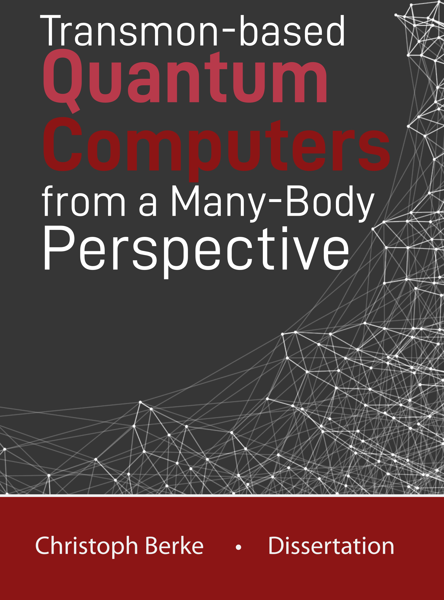



<!-- A detailed CV is [available for download here](../files/cv_berke.pdf) -->

## Short CV

**02/2023 - 06/2024** &ensp; Postdoctoral Research Scientist  *University of Cologne* 

**10/2017 - 02/2023** &ensp; Ph.D. in Physics  *University of Cologne* 

  
Download thesis

  <!-- <figure style = "border:3px #cccccc solid; width:50%"> -->
  <!--  -->
  <!-- </figure> -->
  

  

    
I wrote my Ph.D. thesis under the supervision of <a href="https://www.thp.uni-koeln.de/trebst/index.shtml">Simon Trebst</a> (Chair of Computational Condensed Matter Physics).
  The published version of my thesis can be downloaded here:  <a href="https://kups.ub.uni-koeln.de/71997/"> https://kups.ub.uni-koeln.de/71997/</a>. An updated version, including a list of changes, is available <a href="../files/berke_PhDthesis.pdf"> here </a> and the cover  <a href="../files/berke_PhDcover.pdf"> here </a>.  For an overview of all publications resulting from the research I conducted during my Ph.D., see my  <a href="https://orcid.org/0000-0002-6228-9933">Orcid page</a>.

  

  

  
  

**10/2016 - 06/2017** &ensp; Research Assistant  *TUD Dresden Technical University* 

**10/2013 - 09/2016** &ensp;  Master in Physics  *TUD Dresden Technical University* 

  
Download thesis

  I wrote my Master's thesis under the supervision of  <a href="https://tu-dresden.de/mn/physik/itp/cmt">Carsten Timm</a> (Chair of Theory of Condensed Matter) about the stability of the Weyl semimetal phase on the pyrochlore lattice. The thesis (in german) can be downloaded from <a href="../files/berke_masterthesis.pdf">here</a>. The main results of the thesis have been published in <a href="https://iopscience.iop.org/article/10.1088/1367-2630/aab881">New J. Phys. 20, 043057 (2018)</a>

**10/2010 - 09/2013** &ensp; Bachelor in Physics   *TUD Dresden Technical University* 