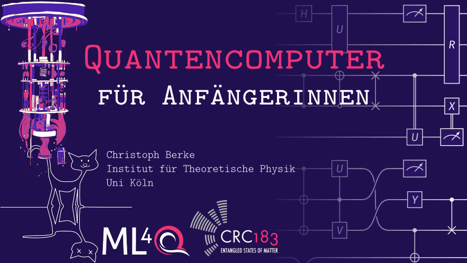
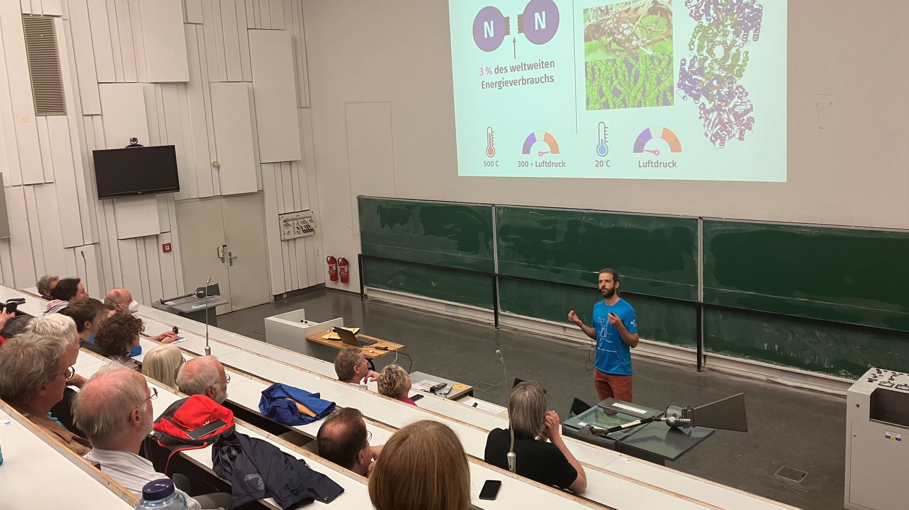
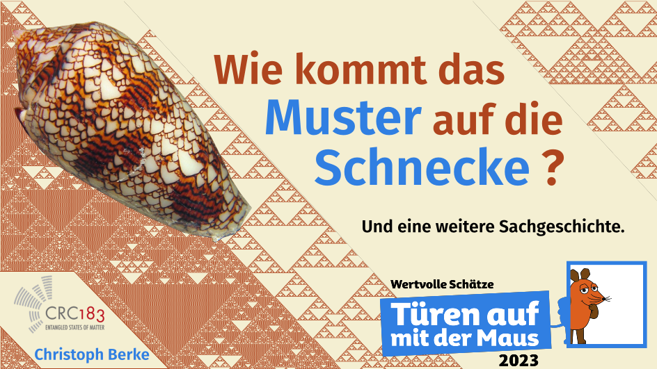
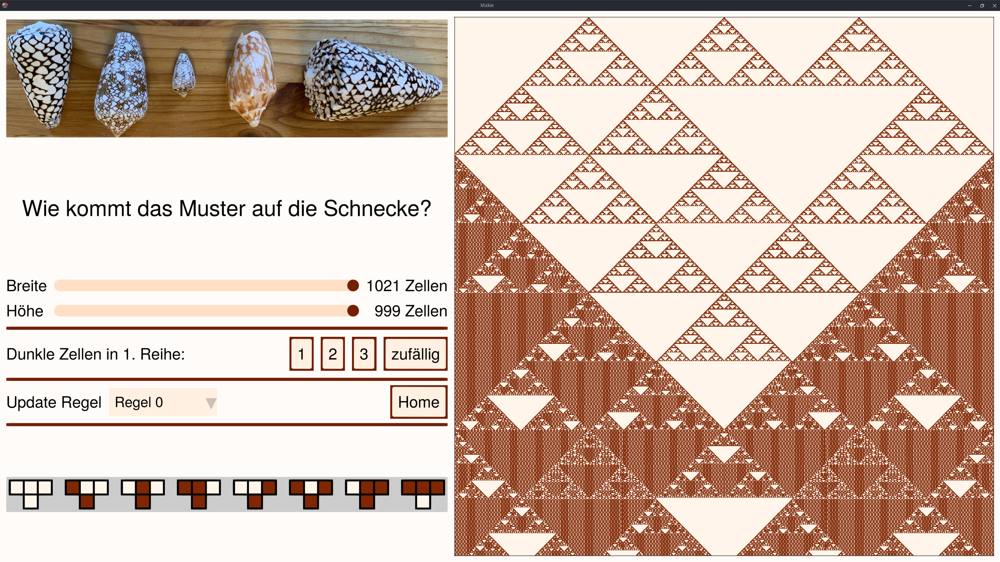
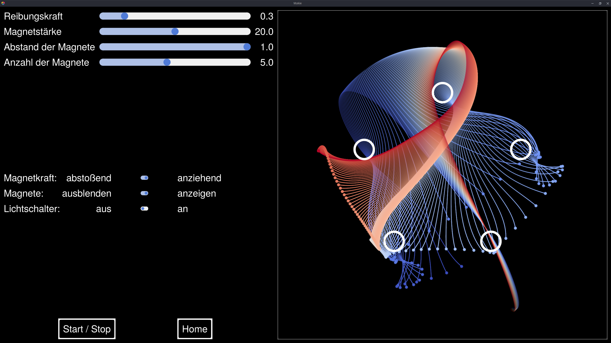
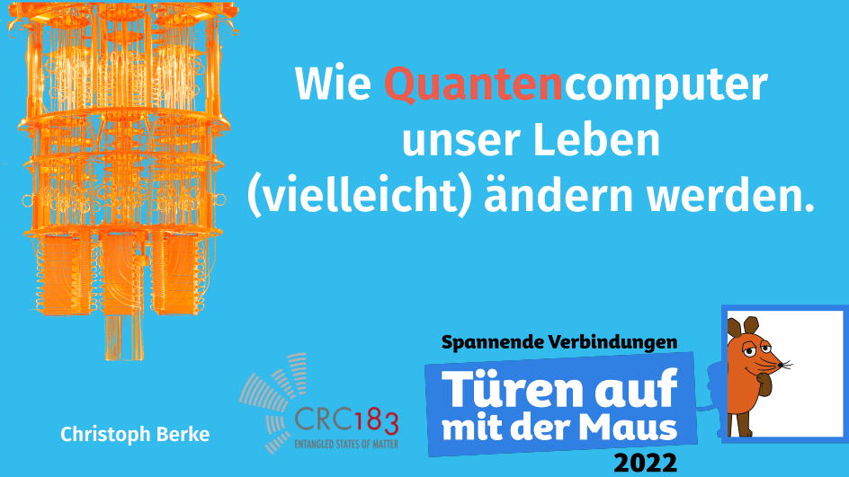
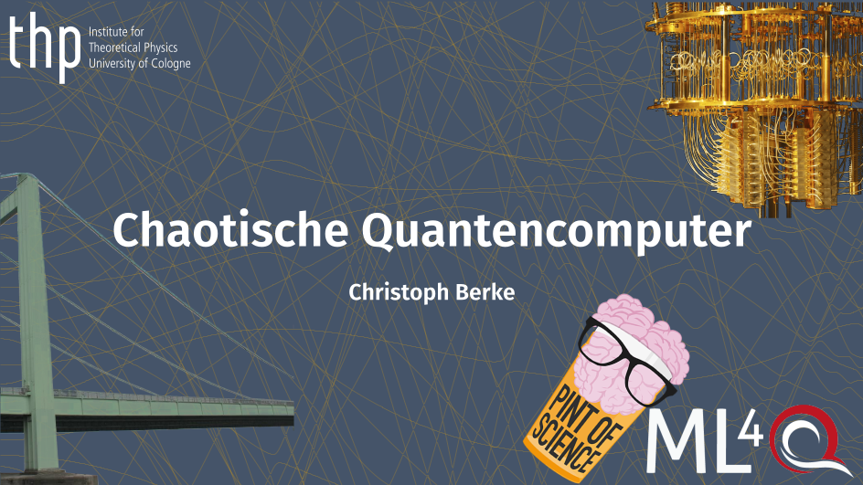
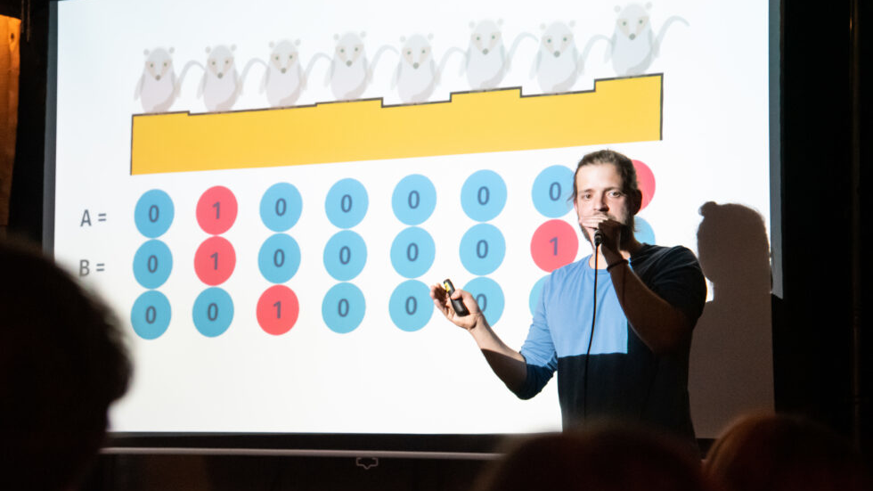
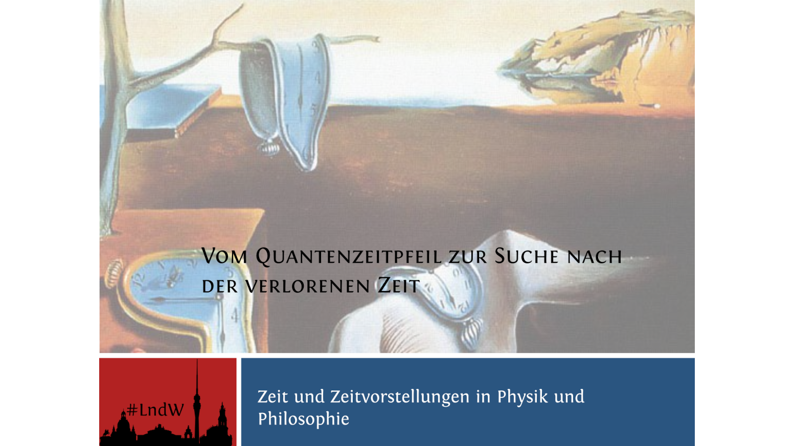

<!-- <!DOCTYPE html> -->
<!-- <html> -->
<meta name="viewport" content="width=device-width, initial-scale=1">

In recent years, I developed a passion for science communication and became actively involved in various public outreach events.
Not only are these events enjoyable for me (and, as far as I can tell, for my audience as well), but I also see these events as crucial to strengthen trust in science and help the public understand the value of funding research. Events I have participated in include

- Long Night of Science (Dresden, 2017): Talk about the quantum mechanical concept of time. <small>(<a href="https://tu-dresden.de/mn/der-bereich/news/interdisziplinaer-und-zukunftsgewandt-physikphilosophie-an-der-tud">learn more</a>)
- Pint of Science (Cologne, 2022): Talk about my research on chaos in quantum computers. <small>(<a href = "https://ml4q.de/2022/05/11/back-in-the-pubs-again-ml4q-pint-of-science-2022/">learn more</a>)</small>
- Türen auf mit der Maus (Cologne, 2022): Introductory talk on quantum computers for children (age 8 - 13). <small>(<a href = "https://ml4q.de/2022/10/10/open-house-with-die-maus-in-the-cologne-physics-institutes/">learn more</a>)</small>
- Türen auf mit der Maus (Cologne, 2023): Computational physics workshop for children (age 8 - 13). <small>(<a href = "https://ml4q.de/2023/10/06/quantenphysik-begeistert-familien-bei-turen-auf-mit-der-maus-in-der-kolner-physik/">learn more</a>, <a href = "https://github.com/christophberke/makiephysicssimulations">download code and slides</a>)</small>
- ZDI-Schülerlabor (Cologne 2024): Computational physics workshop for female pupils (age 14 - 16).  <small>(<a href = "https://ml4q.de/2024/03/04/schnupperuni-physik-beautiful-things-one-can-do-with-theoretical-physics/">learn more</a>)</small>
- 10\. Night of Technologies (Cologne 2024): Introductory talk on quantum computers. <small>(<a href = "https://ml4q.de/2024/06/28/quantum-technology-represented-for-the-first-time-in-nacht-der-technik-cologne/">learn more</a>) </small>

Let me know if you are interested in details or the slides.

## Some impressions

  

    
1 / 9

    
  

  
  

    
2 / 9

    
  

  

    
3 / 9

    
  

  

    
5 / 9

    
  

  

    
4 / 9

    
  

    
  

    
6 / 9

    
  

    
  

    
7 / 9

    
  

  

    
8 / 9

    
  

  

    
9 / 9

    
  

  <a class="prev" onclick="plusSlides(-1)">&#10094;</a>
  <a class="next" onclick="plusSlides(1)">&#10095;</a>

  

    

  

